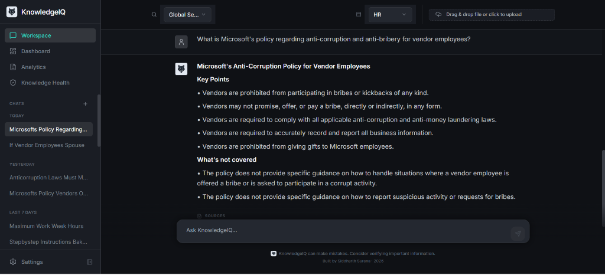
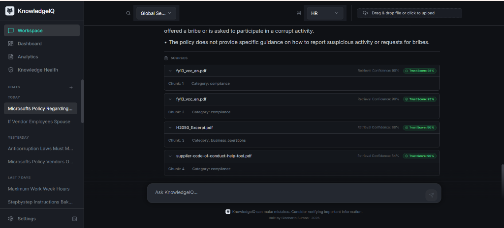
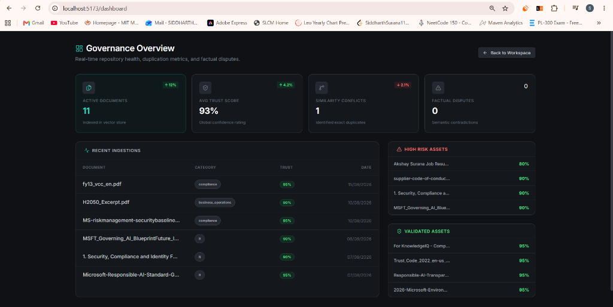
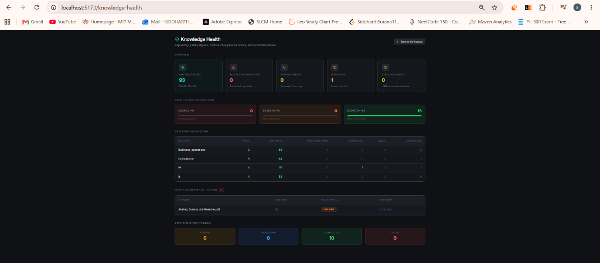
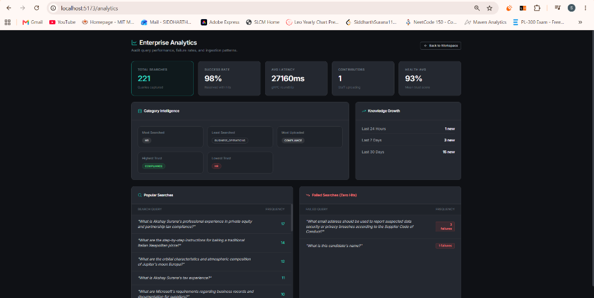
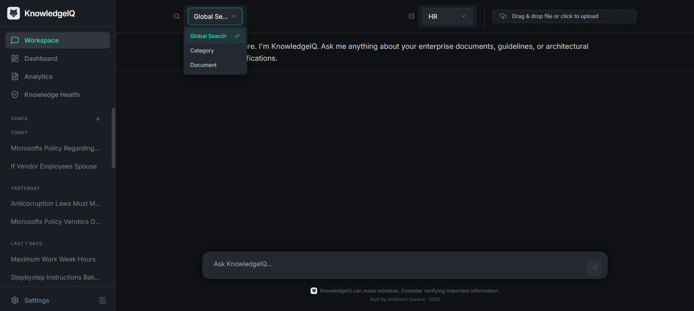
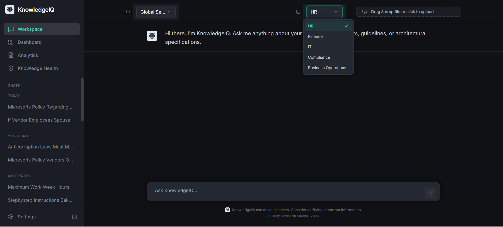
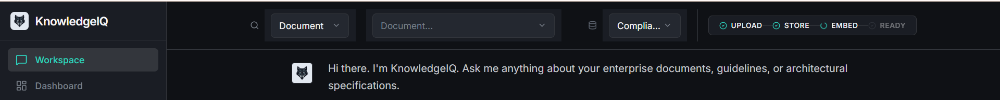

<p align="center">
  
</p>

<h1 align="center">KnowledgeIQ</h1>

<p align="center">
  <b>Enterprise Document Intelligence & Governance Platform</b><br />
  Retrieval-Augmented Generation (RAG) with Hybrid RRF Search, 3-Level Duplicate Detection, and Automated Governance
</p>

<p align="center">
  
  
  
  
  
  
  
</p>

---

## 🎯 Business Problem & Product Vision

In modern enterprises, critical knowledge is frequently fragmented across disconnected repositories, legacy shared drives, and unstructured documents. Teams encounter four major operational bottlenecks:

1. **Unreliable Naive Search**: Standard keyword search and basic vector RAG often return ungrounded, confident-sounding hallucinations when querying complex multi-turn or implicit questions.
2. **Document Duplication**: Multiple versions of identical or near-identical policies (e.g., benefits updates, compliance procedures) accumulate without central version control.
3. **Contradictory Documentation**: Superseded policies conflict with active guidelines, confusing team members and creating compliance risks.
4. **Information Decay**: Documents age without designated owners or review schedules, resulting in outdated guidance persisting in active search indices.

**KnowledgeIQ** solves these challenges by combining a 2-stage neural retrieval architecture with proactive document governance:
- **Hybrid Retrieval & Reranking**: Merges Pinecone dense vector embeddings with sparse BM25 lexical search using Reciprocal Rank Fusion (RRF constant $k=60$) and Cross-Encoder neural reranking for high precision (100% Recall@5).
- **Pre-Retrieval LLM Query Rewriter**: Resolves multi-turn conversational context and implicit pronouns before query execution, operating with a fail-open timeout guard.
- **Hallucination Refusal Guard**: Evaluates response grounding against retrieved context, issuing polite refusals when facts are absent.
- **Automated Document Governance**: Features a 3-level duplicate detection engine (SHA-256 exact match, Pinecone vector similarity $\ge 96\%$, chunk-overlap ratio $> 70\%$), asynchronous contradiction detection workers, trust scoring (0–100), and an administrative governance dashboard.

---

## ⚡ Quick Start (Single-Command Docker Deployment)

Run the entire 5-container KnowledgeIQ stack (MinIO Object Storage, API Gateway, Embedding Service, LLM Failover Service, and Nginx React Frontend) with a single command from the repository root:

```bash
docker compose up --build
```

Once initialized, open your browser to **`http://localhost:5173`** to access the KnowledgeIQ Workspace UI.

---

## 📂 Repository Structure

```
knowledgeiq-platform/
├── apps/
│   ├── api-gateway/            # Express REST API, Auth, Rate Limiting & RRF Hybrid Search
│   ├── embedding-service/      # PyTorch Embeddings, OCR, SpaCy Parsing & Neural Reranker
│   ├── llm-service/            # LLM 3-Tier Failover Chain (Groq → Gemini → OpenRouter) & Query Rewriter
│   └── frontend_reactjs/       # React 18 / Vite SPA with Matte Dark Theme & Governance Views
├── docs/                       # Architectural Specifications, ADRs & Phase Changelogs
│   └── adr/                    # Formal Architecture Decision Records (001, 002, 003)
├── eval/                       # RAG Evaluation Suite (run_eval.py & gold_set.json)
├── protos/                     # gRPC Protobuf Interfaces (embedding_service.proto, llm_service.proto)
├── docker-compose.yml          # Production 5-Container Docker Stack Definition
├── DEPLOYMENT.md               # Cloud PaaS & VM Hosting Guide
├── LICENSE                     # Standard MIT Open Source License
├── README.md                   # Primary Repository Documentation Index
└── start-dev.ps1               # Local Non-Docker Development PowerShell Runner
```

---

## 🏛️ System Architecture

```
                                ┌─────────────────────────────┐
                                │     React / Vite SPA        │
                                │  (Dark Theme Workspace UI)  │
                                └──────────────┬──────────────┘
                                               │ HTTP / REST
                                               ▼
                                ┌─────────────────────────────┐
                                │   API Gateway (Node.js)     │
                                │  Auth, Rate-Limit, Tracing  │
                                └──────┬───────────────┬──────┘
                                       │               │
                        gRPC (50052)   │               │   gRPC (50053)
               ┌───────────────────────┘               └───────────────────────┐
               ▼                                                               ▼
┌───────────────────────────┐                                   ┌───────────────────────────┐
│ Embedding Service (Python)│                                   │ LLM Failover (Python)     │
│ PyTorch, SpaCy Parsing,   │                                   │ Query Rewriter, Groq,     │
│ Cross-Encoder Reranker    │                                   │ Gemini, OpenRouter        │
└─────────────┬─────────────┘                                   └───────────────────────────┘
              │
              ├──────────────────────┬──────────────────────┐
              ▼                      ▼                      ▼
    ┌──────────────────┐   ┌──────────────────┐   ┌──────────────────┐
    │  MongoDB Atlas   │   │  Pinecone Vector │   │  MinIO S3 Blob   │
    │  Docs & Analytics│   │  Hybrid Index    │   │  Raw Document Store│
    └──────────────────┘   └──────────────────┘   └──────────────────┘
```

---

## 💡 Key Engineering Decisions (Architecture Decision Records)

KnowledgeIQ's technical evolution is guided by three formal Architecture Decision Records (ADRs):

1. **[ADR 001: MinIO / S3-Compatible Object Storage Persistence](docs/adr/001-storage-backend.md)**
   - *Decision*: Standardized on MinIO / S3 object storage for raw uploaded document persistence, superseding legacy Google Drive dependencies to deliver local/in-cluster containerized blob storage.
2. **[ADR 002: Async Worker Queue for Contradiction Detection](docs/adr/002-contradiction-detection-location.md)**
   - *Decision*: Decoupled document contradiction detection from synchronous upload HTTP requests into an asynchronous background polling worker (`ContradictionWorker`), maintaining upload latency under 2 seconds.
3. **[ADR 003: Pre-Retrieval LLM Query Rewriting & Fail-Open Design](docs/adr/003-query-rewriting.md)**
   - *Decision*: Introduced an LLM-based query rewriter before document retrieval to resolve multi-turn pronouns and implicit context. Designed with a strict 3.5s timeout (`QUERY_REWRITE_TIMEOUT_MS`) that automatically **fails open** to the raw user query if upstream providers time out or encounter rate limits.

---

## 📊 Retrieval Quality & Evaluation Benchmark Metrics

Retrieval accuracy and hallucination safety are continuously validated using an automated evaluation harness (`eval/run_eval.py`) operating against an enterprise ground-truth dataset (`eval/gold_set.json`).

*Latest evaluation results with Query Rewriting enabled (`QUERY_REWRITE_ENABLED=true`):*

| Metric | Score | Passed / Total | Description |
|---|---|---|---|
| **Recall@5** | **100.0%** | 6/6 | Top-5 retrieval accuracy across standard corporate queries |
| **Supersession Accuracy** | **100.0%** | 1/1 | Correct preference for active vs superseded document versions |
| **Abstention Correctness** | **100.0%** | 2/2 | Perfect hallucination guard refusal on out-of-domain queries |
| **Faithfulness Proxy** | **83.3%** <sup>*</sup> | 5/6 | Literal phrase alignment against ground-truth excerpts |
| **Query Success Rate** | **100.0%** | 6/6 | Zero unhandled runtime exceptions or gateway errors |

*\* Note: Faithfulness Proxy improved from 57.1% (4/7) to 83.3% (5/6) after raising provider completion token limits to 2500, eliminating false refusals caused by scratchpad CoT truncation (see commit [`4fe294c`](https://github.com/SiddharthSurana11/knowledgeiq/commit/4fe294c3e8062616896973c1f24fa40aae1eae8c)).*

---

## ⚠️ Known Limitations & Operational Tradeoffs

1. **Free-Tier Provider Rate Limits & Failover Latency**:
   - The LLM service implements a 3-tier provider failover chain (Groq → Gemini → OpenRouter). Under heavy load or free-tier API rate limits (HTTP 429), failover transitions add latency to chat requests while waiting for secondary providers.
2. **MongoDB Atlas Network Access (IP Access List Requirement)**:
   - KnowledgeIQ relies on MongoDB Atlas for document metadata, governance issues, and feedback persistence. When deploying to cloud environments (e.g. Railway, Render, Oracle Cloud VM), you must configure MongoDB Atlas Network Access to whitelist your server IP address (or `0.0.0.0/0` for dynamic PaaS hosts) to allow inbound database connections.
3. **Query Rewriting Latency & Quota Tradeoff**:
   - The pre-retrieval query rewriting step adds **1 additional LLM API call** per chat request to resolve multi-turn context. While wrapped in a fail-open 3.5s timeout, this introduces a minor latency overhead (~700ms–1.5s) and consumes provider token quota.
4. **Fixed Token Sliding-Window Chunking**:
   - Documents are currently split using `tiktoken` sliding token windows (800 tokens / 100 overlap). While sentence boundary detection prevents chopping words, topic shifts mid-chunk are bounded by fixed token counts rather than AST/semantic section breaks.

---

## 📌 Strategic Roadmap (Designed But Not Built)

As documented in [`docs/ROADMAP.md`](docs/ROADMAP.md), the following features are architecturally scoped for future releases:

1. **GraphRAG & Knowledge Graphs**:
   - Building entity-relationship graphs from ingested documents for complex multi-entity relation queries. Scoped out for initial release due to implementation complexity; hybrid RRF + cross-encoder reranking currently achieves 100% Recall@5.
2. **Semantic & Structural Chunking**:
   - Dynamic embedding-distance splitting and Markdown header chunking. Scoped out because re-chunking existing documents would invalidate ground-truth chunk IDs in `eval/gold_set.json` and incur substantial re-embedding costs.

---

## 🛠️ Local Non-Docker Development Setup

If you prefer iterating locally without Docker containers:

### PowerShell One-Click Startup (Windows)
Run the convenience script to launch all 4 application services in separate terminal tabs with automatic `venv` activation:
```powershell
.\start-dev.ps1
```

### Manual Service Startup
1. **MinIO Server**: `minio server /path/to/minio_data` (Port 9000)
2. **Embedding Service**: `cd apps/embedding-service && .\venv\Scripts\activate && python app.py` (Port 50052)
3. **LLM Service**: `cd apps/llm-service && .\venv\Scripts\activate && python app.py` (Port 50053)
4. **API Gateway**: `cd apps/api-gateway && npm start` (Port 5000)
5. **Frontend**: `cd apps/frontend_reactjs && npm run dev` (Port 5173)

---

## 🖼️ Application Screenshots & UI Showcase

*The KnowledgeIQ UI features a sleek matte dark theme (`#0A0A0B`), wolf brand mark, slate avatar chips, and integrated workspace footer.*

### 1. Enterprise Workspace Chat Interface


### 2. Multi-Chunk Sources & Trust Score Breakdown


### 3. Real-Time Governance Overview


### 4. Knowledge Health & Contradiction Pipeline Status


### 5. Enterprise Search & Query Performance Analytics


### 6. Scope Selection (Global vs Document Scope)


### 7. Document Category Tagging


### 8. Document Upload & Ingestion Pipeline Progress


---

## 👤 Author

**Siddharth Surana**<br />
Quantitative Computing & Software Systems Engineering<br />
GitHub: [@SiddharthSurana11](https://github.com/SiddharthSurana11)

---

## 📄 License & Project Documentation

KnowledgeIQ is released under the **[MIT License](LICENSE)**. For technical specifications, changelogs, and cloud deployment guides, refer to:
- **[KnowledgeIQ Master Project History Index](docs/PROJECT_HISTORY.md)**
- **[Production Deployment & PaaS Guide](DEPLOYMENT.md)**
