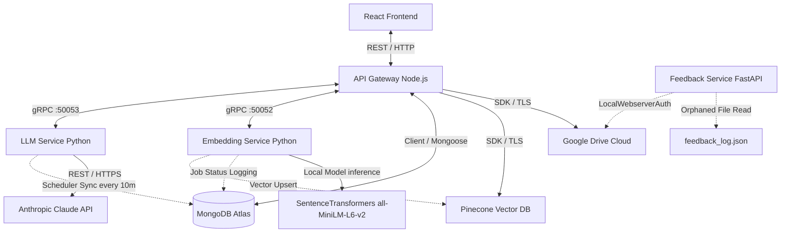
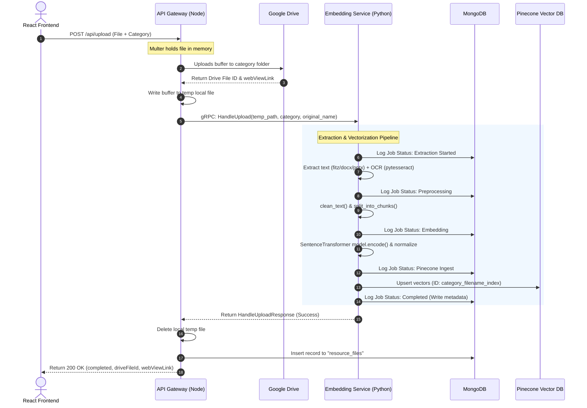
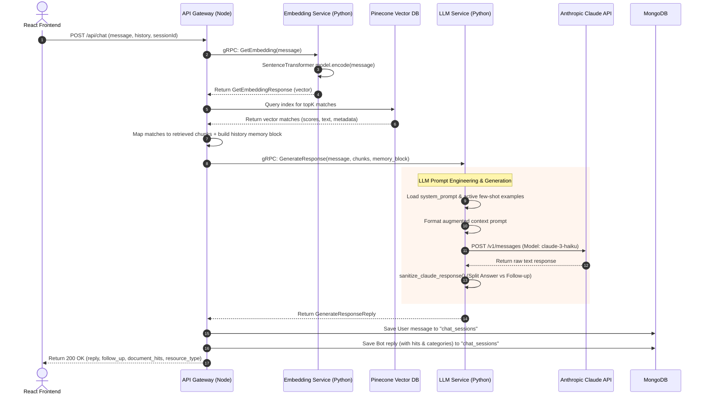
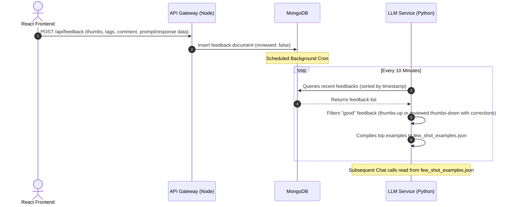

# Enterprise Codebase Audit & Architecture Review
**Project:** AI Chatbot (Enterprise Document Intelligence Specialist)
**Author:** Principal Software Architect  

This document provides a comprehensive architecture audit, data flow mapping, component analysis, and reusability assessment of the repository.

---

## 1. System Architecture Overview

The system is a distributed **Retrieval-Augmented Generation (RAG)** application designed to ingest documents (PDF, DOCX, PPTX, Images), extract and chunk their content, embed them into a vector space, and provide context-aware query responses using Anthropic's Claude. It also features a self-correcting dynamic few-shot feedback loop.

### High-Level Architecture Diagram

---

## 2. Component Responsibilities

| Component | Technology | Primary Responsibilities |
| :--- | :--- | :--- |
| **Frontend** | React, Vite, Tailwind CSS | <ul><li>Provides user interface for chat sessions and document category uploads (e.g., HR, Finance, IT, Other).</li><li>Captures fine-grained user feedback (thumbs up/down, error classification tags, and text comments).</li><li>Maintains real-time admin view for polling and reviewing feedback.</li></ul> |
| **API Gateway** | Node.js, Express, gRPC Clients | <ul><li>Acts as the central router (`/api/chat`, `/api/upload`, `/api/feedback`, `/api/sessions`).</li><li>Coordinates the upload pipeline by saving raw files to Google Drive, writing to temporary storage, and initiating gRPC processes.</li><li>Retrieves relevant metadata chunks directly from Pinecone to form RAG contexts.</li><li>Manages chat session CRUD and feedback storage in MongoDB.</li></ul> |
| **Embedding Service** | Python, gRPC Server, SentenceTransformers | <ul><li>Extracts text from multi-format files (PDF, DOCX, PPTX, JPEG, PNG).</li><li>Executes OCR via `pytesseract` for scanned PDFs, presentation images, and document tables.</li><li>Cleans text, tokenizes (via `tiktoken` for `gpt-4` lengths), and constructs overlapping chunks (800 token limits, 100 token overlap).</li><li>Generates normalized vectors (384-dimensional) using `all-MiniLM-L6-v2`.</li><li>Upserts vector payloads directly to Pinecone and records job statuses to MongoDB.</li></ul> |
| **LLM Service** | Python, gRPC Server, APScheduler | <ul><li>Wraps the Anthropic Claude API to generate answers, follow-up questions, and track document hits.</li><li>Maintains a background cron job (APScheduler) running every 10 minutes to ingest MongoDB feedback.</li><li>Dynamically compiles approved feedback into a serialized `few_shot_examples.json` block injected into system prompts.</li></ul> |
| **Feedback Service** | Python, FastAPI, PyDrive2 | <ul><li>*Legacy/Orphaned component*: Intended to export negative/reviewed feedback to CSV and upload it to Google Drive.</li><li>*Note: Currently disconnected from MongoDB and relies on a manual local JSON file.*</li></ul> |

---

## 3. Data Pipelines & Flow Mapping

### A. Document Upload & Ingestion Pipeline

This pipeline handles file storage, text extraction, semantic chunking, and vector index updates.

### B. Chat & Query Processing Flow (RAG)

This flow is executed when a user submits a question. It performs semantic search to augment the LLM prompt.

### C. Feedback Dynamic Ingestion Flow

This background loop optimizes model generation using human-in-the-loop validation.

---

## 4. Technical Stack Breakdown

*   **Runtime Environments**: Node.js (v18+), Python (3.10+)
*   **Web Frameworks**: Express.js (Node Gateway), FastAPI (Python Feedback - disconnected)
*   **Microservice Communication**: gRPC via HTTP/2 (using `@grpc/grpc-js` and `grpcio`/`grpcio-tools`)
*   **Databases**: 
    *   **MongoDB Atlas**: Relational chat sessions, resource logs, job tracking, and feedback metrics.
    *   **Pinecone**: Serverless vector database index (AWS / `us-east-1`, using cosine metric, 384 dimensions).
*   **AI & Machine Learning**:
    *   **Model Hosting (Local)**: `SentenceTransformers` (`all-MiniLM-L6-v2`) for generating 384-dimensional embeddings.
    *   **LLM API**: Anthropic Claude API (`claude-3-haiku-20240307` model, temperature `0.25`).
*   **Document Extraction / OCR**:
    *   `PyMuPDF` (`fitz`): High-speed PDF parsing.
    *   `python-docx` / `python-pptx`: Word and PowerPoint structuring.
    *   `pytesseract`: Optical Character Recognition (OCR) fallback for scanned PDFs and image files.
*   **Natural Language Processing**:
    *   `spaCy` (`en_core_web_sm`): Sentence segmentation.
    *   `tiktoken`: Token calculation configured for `gpt-4` encoders.

---

## 5. Architecture Design Patterns Used

1.  **API Gateway Pattern**: The Node.js gateway consolidates routing, manages external data sources (Google Drive, MongoDB, Pinecone), handles CORS, and exposes unified REST APIs to the React frontend while orchestrating behind-the-scenes gRPC microservices.
2.  **Retrieval-Augmented Generation (RAG)**: Connects a generative LLM to a curated vector index, ensuring model constraints (no hallucinations, strict grounding in provided materials).
3.  **Human-In-The-Loop Few-Shot Ingestion**: Rather than static system prompts, the LLM uses a scheduled synchronization agent to inject approved user corrections directly into the context window.
4.  **Adapter / Repository Pattern**: Utility files like [pineconeClient.js](../apps/api-gateway/utils/pineconeClient.js) and [driveClient.js](../apps/api-gateway/utils/driveClient.js) abstract remote infrastructure calls away from route handlers.

---

## 6. Critical Architectural Discrepancies & Gaps

During the codebase audit, several architectural issues and functional gaps were identified:

> [!WARNING]
> **Orphaned Feedback Service**
> The `feedback-service` FastAPI application is currently detached from the system flow:
> 1. It attempts to read feedback from a local JSON file path: `PROJECT_ROOT / "backend" / "logs" / "feedback_log.json"`. However, the API Gateway saves all user feedback directly to **MongoDB**.
> 2. It utilizes `gauth.LocalWebserverAuth()` via PyDrive2. This opens a local web browser interface to authenticate. In a headless server deployment (Docker, Cloud Run, EC2), this authentication flow **will crash the service**.
> 
> *Architectural recommendation:* Deprecate this service or refactor it to query MongoDB, and replace its browser-based authentication with a Google Service Account (similar to the API Gateway's `driveClient.js`).

> [!NOTE]
> **Inefficient Text Preprocessing**
> In `data_preprocessing.py`, the `clean_text` function executes `text = re.sub(r'[^\w\s]', '', text)` and `text.lower()`.
> * While this is common for older lexical search models, modern SentenceTransformers and LLMs (Claude) perform better when text preserves punctuation, casing, and semantic structure. 
> * Stripping all punctuation blocks bullet points, lists, and numbers, which degrades RAG retrieval and comprehension.

> [!IMPORTANT]
> **Shared Database Responsibilities**
> The API Gateway directly queries Pinecone for vector matching. 
> * Traditionally, vector DB querying should be encapsulated within the `Embedding Service` or a dedicated `Search Service` so that the Node.js API Gateway does not need to load Python-equivalent embedding models, know about vector dimensions, or manage Pinecone client configurations.

---

## 7. Reusability Analysis for **KnowledgeIQ**

**KnowledgeIQ** is a new enterprise product. Below is the reusability matrix for migrating components:

| Component | Code Location | Reusability | Migration/Refactoring Effort |
| :--- | :--- | :--- | :--- |
| **Document Ingestion Engine** | `apps/embedding-service/modules/chunking/` | **90%** | **Low**. The extraction modules (`data_extraction.py`) for PDF/Word/PPTX with OCR fallbacks are clean, modular, and can be reused as-is. |
| **Local Embeddings Generator** | `apps/embedding-service/modules/vectorDB/embedder.py` | **85%** | **Low**. SentenceTransformers adapter works well. The dimension matches 384. If KnowledgeIQ requires a larger model (e.g., `text-embedding-3-large` or `bge-large-en-v1.5`), simply update the env config variables. |
| **Few-Shot Feed Scheduler** | `apps/llm-service/feedback_to_fewshot.py` | **70%** | **Medium**. The scheduler loop is solid. However, the logic for evaluating "good" feedback (`is_good`) is hardcoded to look for LMS/LOS tags and should be generalized. |
| **RAG Prompt Manager** | `apps/llm-service/response_generator.py` | **60%** | **Medium**. The prompt system is highly specific to LMS/LOS/Syndicate documents. You will need to rewrite the prompt templates and system guidelines in `prompt_instructions.txt` for KnowledgeIQ. |
| **Node API Gateway** | `apps/api-gateway/` | **40%** | **High**. The session and chat routes are standard, but the drive folder mapping (`GDRIVE_LMS_FOLDER_ID`, etc.) and the upload handler are tightly coupled to the categories of this specific application. |
