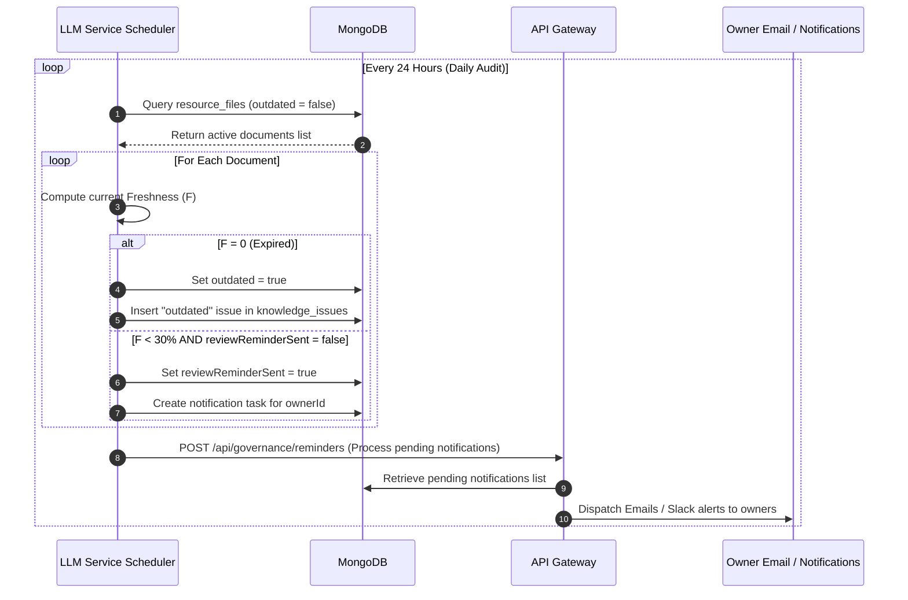

# Knowledge Freshness & Governance Engine Design

This document describes the design for the **Knowledge Freshness & Governance Engine** for KnowledgeIQ, establishing document decay rules, ownership assignment, automated reminders, and governance dashboard KPIs.

---

## 1. Mathematical Modeling of Freshness

To quantify document freshness without complex cron daemons, we introduce a category-based decay model.

### A. Freshness Score Formula

For document $d$ with last review timestamp $T_{last}$ and current time $T_{now}$:

$$D_{days} = \frac{T_{now} - T_{last}}{\text{1 day}}$$

Let $L_{cycle}$ be the **Review Cycle Length** (in days) configured for the document's category (e.g., 90 days for Syllabuses, 365 days for HR Policies). The **Freshness Score** ($F$) is calculated as:

$$F = \max\left(0, 100 \times \left(1 - \frac{D_{days}}{L_{cycle}}\right)\right)$$

*   **Fresh ($F \ge 70$%)**: Document is up-to-date.
*   **Warning ($30\% \le F < 70\%$)**: Document is approaching expiration.
*   **Outdated ($F < 30\%$)**: Triggers an automatic review reminder. At $F = 0$, the document is marked as `outdated: true`.

---

## 2. Database & Metadata Schema Changes

We reuse the existing MongoDB database and Pinecone index by introducing metadata fields.

### A. MongoDB Schema Updates

#### 1. Collection `categories` (Extensions)
Define default review cycles per category.
```json
{
  "_id": "ObjectId",
  "key": "hr_policies",
  "name": "HR & Benefits",
  "reviewCycleDays": 365,      // Review cycle (1 year)
  "escalationThreshold": 30    // Days remaining to trigger escalation
}
```

#### 2. Collection `resource_files` (Extensions)
Store ownership, verification dates, and lifecycle statuses.
```json
{
  "_id": "ObjectId",
  "filename": "benefits_handbook_2026.pdf",
  "ownerId": "ObjectId",       // Owner in the users collection
  "lastReviewedAt": "ISODate", // Date of last audit/verification
  "freshnessScore": 92,        // Cached freshness calculation
  "outdated": false,           // Flag set when freshness <= 0
  "reviewReminderSent": false  // Flag to prevent reminder spam
}
```

### B. Pinecone Vector Metadata Updates
During ingestion (in the `Embedding Service`), we write ownership and review dates directly into Pinecone metadata. This allows **owner-based** or **freshness-based** vector filtering during search queries.
```json
{
  "filename": "benefits_handbook_2026.pdf",
  "category": "hr_policies",
  "ownerId": "owner_user_id_123",
  "lastReviewedAt": "2026-06-20T00:00:00Z",
  "text": "...chunk text content..."
}
```

---

## 3. Trust Score Integration

The Freshness Score and Ownership status feed directly into the main **Trust Score** formula:

$$\text{Trust Score} = (0.5 \times F) + (0.5 \times \text{Quality Score})$$

Where **Quality Score** is calculated out of $100$ and suffers penalties for structural issues:
*   **Unowned Document Penalty**: $-20$ points (if `ownerId` is null).
*   **Active Contradiction Penalty**: $-30$ points per unresolved conflict.
*   **Active Duplicate Penalty**: $-15$ points.
*   **Feedback Penalty**: $-2$ points per thumbs-down.

This ensures a document can never achieve a high trust rating if it is unowned, outdated, or conflicts with other sources.

---

## 4. API Extensions (API Gateway)

We add endpoints to handle ownership assignment, auditing, and reminder triggers.

| Endpoint | Method | Payload | Description |
| :--- | :--- | :--- | :--- |
| `/api/governance/overview` | `GET` | None | Returns governance KPIs: Ownership Coverage, Outdated document rate, and Category Stale Index. |
| `/api/resources/:id/owner` | `PUT` | `{ ownerId: "123" }` | Assigns or transfers document ownership. |
| `/api/resources/:id/verify` | `POST` | None | Reset review cycle by updating `lastReviewedAt` to current date and clearing `reviewReminderSent`. |
| `/api/governance/reminders` | `POST` | None | Manually trigger scan for upcoming reviews (calls notification dispatcher). |

---

## 5. Sequence Flow: Scheduled Review & Escalation

We reuse the `APScheduler` job queue running in the **LLM Service** to query MongoDB and dispatch reminders without introducing a new worker daemon.



---

## 6. UI Dashboards Additions (Governance Panel)

We append a **Governance & Ownership** tab to the Admin Panel.

```
+-------------------------------------------------------------------------+
|  [IQ] KnowledgeIQ Governance  | Health | [Freshness & Governance]       |
+-------------------------------------------------------------------------+
|  OWNERSHIP COVERAGE: [ 94% ]        AVERAGE FRESHNESS INDEX: [ 81 / 100]|
|  UNOWNED DOCUMENTS:  [ 12 Files ]   OUTDATED DOCUMENTS:      [ 4 Files ]|
+-------------------------------------------------------------------------+
| GOVERNANCE WATCHLIST                                                    |
|                                                                         |
| [!] OUTDATED (Freshness: 0%)                                            |
|     File: travel_policy_2024.docx | Owner: Jane Doe (HR) | Category: HR |
|     Last Reviewed: 420 Days ago (Limit: 365 Days)                       |
|     [Send Alert]  [Claim Document]  [Mark Reviewed (Verify)]            |
|                                                                         |
| [?] UNOWNED (Freshness: 72%)                                            |
|     File: dev_setup_guide.pdf     | Owner: [ Assign Owner v ]           |
|     Last Uploaded: 90 Days ago                                          |
|     [Claim Document]                                                    |
+-------------------------------------------------------------------------+
```

---

## 7. Reusability & Complexity Assessment

*   **Database (MongoDB): 95% Reused**  
    We simply append `ownerId`, `lastReviewedAt`, and a few status flags to the existing `resource_files` and `categories` collections. No new database instances or tables are required.
*   **Vector DB (Pinecone): 100% Reused**  
    We append `ownerId` and `lastReviewedAt` directly to the metadata payload during ingestion. No schema changes or index rebuilds are required since Pinecone supports dynamic metadata filtering.
*   **LLM Service (APScheduler): 90% Reused**  
    The daily governance scan is added as a new job inside the existing Python scheduler in `llm-service/app.py` (which already runs background database routines). No new scheduler microservices are introduced.
*   **Development Complexity: Low**  
    Calculations (Freshness, Trust) are pure math functions executed dynamically in Node.js/Python query middleware, requiring no persistent analytical memory or specialized engines.
