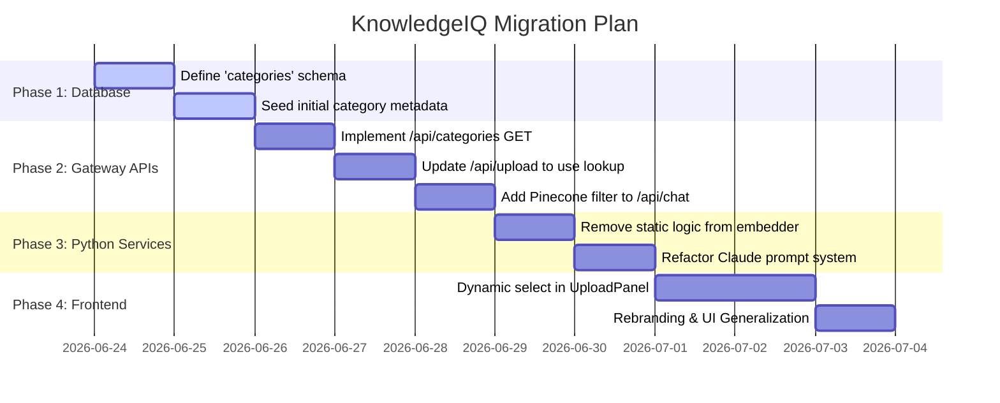

# Migration Design: Transforming Sigma into KnowledgeIQ

This design document outlines the minimum necessary changes to generalize the hardcoded, category-specific Sigma architecture into a dynamic, scaleable enterprise knowledge base called **KnowledgeIQ**, maximizing code reuse.

---

## 1. Core Architectural Shift

Sigma contains hardcoded configurations for **LMS**, **LOS**, and **LF Syndicate** documents. To transform it into **KnowledgeIQ**, we must transition from **static domain hardcoding** to **dynamic domain mapping** driven by database configurations.

```mermaid
graph LR
    subgraph Sigma (Static)
        A["Hardcoded Categories (LMS, LOS, Syndicate)"] --> B[Static Prompts & Hardcoded UI]
    end
    subgraph KnowledgeIQ (Dynamic)
        C[MongoDB Config: 'categories'] --> D[Dynamic UI Uploads]
        C --> E[Filtered Vector Search]
        C --> F[Dynamic Prompt Assembly]
    end
```

---

## 2. Database Schema Changes (MongoDB)

We will introduce a dynamic registry for document categories, removing the need to edit codebase files when new knowledge domains are added.

### A. New Collection: `categories`
This collection manages metadata, access keys, and folder mappings.
```json
{
  "_id": "ObjectId",
  "key": "hr_policies",              // Unique slug used in Pinecone metadata
  "name": "HR & Benefits Policies",   // Display name in UI
  "driveFolderId": "1taRknFSolx...", // Target Google Drive directory
  "description": "Rules, forms, and benefit details for employees.",
  "createdAt": "ISODate"
}
```

### B. Updated Collection Schema: `resource_files`
Convert the string field `category` to reference a dynamic category key.
```diff
  {
    "filename": "annual_leave_2026.pdf",
    "driveFileId": "drive_id_123",
    "uploadedAt": "ISODate",
-   "category": "LMS", 
+   "category": "hr_policies", // Matches a record in the 'categories' collection
    "embeddingStatus": "completed"
  }
```

---

## 3. API Gateway Changes (Express Node.js)

We need to add a categories endpoint and modify upload and chat parameters.

### A. New Endpoint: `GET /api/categories`
*   **Behavior**: Fetches all documents from the `categories` collection in MongoDB.
*   **Purpose**: Populates the UI upload sections and filters.

### B. Modified Endpoint: `POST /api/upload`
*   **Behavior**: Accepts `categoryId` in the multipart form data instead of a hardcoded string.
*   **Changes**: 
    1. Query the `categories` database collection to resolve the `driveFolderId`.
    2. Upload file to Google Drive.
    3. Pass the category key directly to the Embedding Service gRPC payload.

### C. Modified Endpoint: `POST /api/chat`
*   **Behavior**: Accept an optional `categoryId` filter parameter.
*   **Changes**: 
    1. Pass `categoryId` to `getRelevantChunks(message, categoryId)`.
    2. In `pineconeClient.js`, execute the query with a metadata filter:
       ```js
       const filter = categoryId ? { category: { "$eq": categoryId } } : undefined;
       const results = await index.query({ vector: embedding, topK, filter, includeMetadata: true });
       ```

---

## 4. Service-Level Changes (gRPC & Logic)

### A. Embedding Service (Python)
*   **`vector_db_pinecone.py`**:
    *   **REMOVE** the `detect_category(query_text)` function which searches for static string matches like `'LMS'`, `'LOS'`, and `'LF Syndicate'`.
    *   Rely on metadata-based category filtering passed dynamically by the API Gateway during semantic queries.
*   **`app.py`**:
    *   Keep the gRPC interface `HandleUpload` and `GetEmbedding` intact. The category ID continues to flow naturally into Pinecone as metadata.

### B. LLM Service (Python)
*   **`prompt_instructions.txt`**:
    *   Generalize the system prompt template. Replace specific references:
    ```diff
-   You are a smart assistant trained specifically on LMS, LOS, and LF Syndicate documents.
+   You are KnowledgeIQ, a highly capable assistant trained on internal company documentation.
-   The documents don’t seem to have information on this. Would you like a general overview instead?
+   I could not find relevant facts in the corporate knowledge base to answer your question.
    ```
*   **`response_generator.py`**:
    *   Dynamically compile the prompt. When constructing the prompt, pull description details of the category if an active category filter is used.
*   **`feedback_to_fewshot.py`**:
    *   Generalize few-shot extraction. Ensure `is_good` does not check hardcoded tag lists.

---

## 5. UI Changes (React Frontend)

The UI will transition to a polished, unified dashboard.

```
+-------------------------------------------------------------+
|  [IQ] KnowledgeIQ Dashboard                                 |
+----------------------+--------------------------------------+
| CHAT HISTORY         |  Active Filter: [All Categories v]   |
|                      +--------------------------------------+
| - Q1 Benefits        |  👋 Hi! I'm KnowledgeIQ. Ask me      |
| - Q2 LMS Syllabus    |  anything about our loaded systems.  |
|                      |                                      |
| [New Chat Session]   |                                      |
|                      |  [ Type your question...   ] [Send]  |
+----------------------+--------------------------------------+
| UPLOAD KNOWLEDGE                                            |
| Select Folder: [ HR & Benefits v ]  [ Choose File ] [Upload] |
+-------------------------------------------------------------+
```

### A. UploadPanel Component
*   **Modify**: Fetch active categories from `GET /api/categories` on load.
*   **UI Change**: Render a single dropdown list of categories alongside a file picker, instead of rendering individual buttons for every category:
    ```jsx
    // Dynamic replacement
    <select onChange={(e) => setSelectedCategory(e.target.value)}>
      {categories.map(cat => <option value={cat.key}>{cat.name}</option>)}
    </select>
    ```

### B. Sidebar & ChatBox Component
*   **Modify**: Update logos, branding, and text prompts from "Sigma" to "KnowledgeIQ".
*   **UI Change**: Add a category selector dropdown in the chat toolbar to allow users to focus their search on specific knowledge areas (e.g., limit responses strictly to Legal or Engineering).

---

## 6. Implementation Checklist & Migration Sequence


