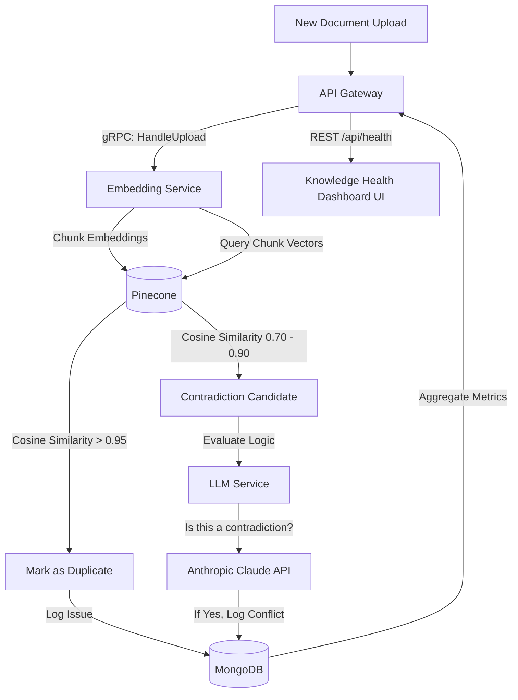
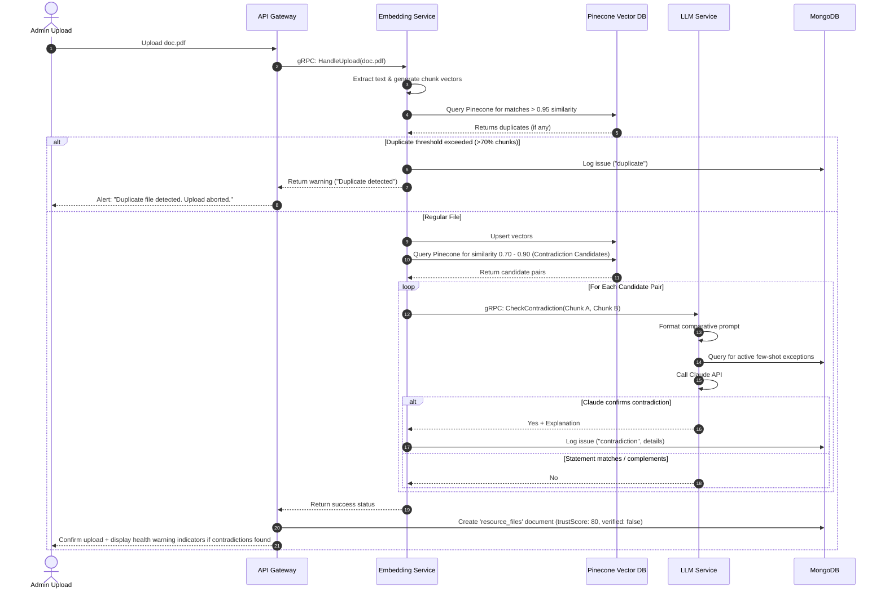

# KnowledgeIQ Quality Engines: Architectural Design

This document details the design for adding the **Duplicate Detection**, **Contradiction Detection**, **Trust Score**, and **Knowledge Health Dashboard** engines to the KnowledgeIQ platform, maximizing code reuse from the original prototype architecture.

---

## 1. Architectural Adaptations

Instead of introducing separate microservices, we leverage the **Embedding Service** and **LLM Service** to perform structural and semantic quality checks:
*   **Duplicate Detection** is performed at ingestion time by querying the vector database (Pinecone) with a document's new chunks and measuring similarity.
*   **Contradiction Detection** uses the vector database to find semantically similar chunks (candidates) and delegates the logical verification to **Claude** (via the LLM Service) using zero-shot prompting.
*   **Trust Scores** are dynamically aggregated in the API Gateway from MongoDB metrics (recency, user feedback ratios, and active issues).



---

## 2. Database Schema Changes (MongoDB)

We extend the database schema to track document health, conflicts, and ownership.

### A. New Collection: `knowledge_issues`
Tracks active duplicate, contradiction, or metadata issues.
```json
{
  "_id": "ObjectId",
  "issueType": "duplicate | contradiction | outdated | unowned",
  "severity": "high | medium | low",
  "status": "active | resolved | ignored",
  "sourceFileId": "ObjectId",       // File where issue was detected
  "targetFileId": "ObjectId",       // Conflicting/duplicate file (optional)
  "details": {
    "description": "Excerpts contradict on office opening times.",
    "sourceChunkId": "hr_policy_12",
    "targetChunkId": "office_manual_5",
    "sourceExcerpt": "Office opens at 9:00 AM.",
    "targetExcerpt": "Office opens at 10:30 AM."
  },
  "detectedAt": "ISODate",
  "resolvedAt": "ISODate",
  "resolvedBy": "ObjectId"
}
```

### B. Extended Schema: `resource_files`
Add verification metadata, trust scores, and owner attributes.
```diff
  {
    "filename": "lms_guideline.pdf",
    "driveFileId": "1HnAHMBU...",
    "category": "lms",
+   "owner": "ObjectId",             // User ID of document owner
+   "verified": true,                // Manual admin validation flag
+   "trustScore": 82,                // Dynamic score (0 - 100)
+   "lastReviewedAt": "ISODate",     // Ownership review timestamp
    "embeddingStatus": "completed"
  }
```

---

## 3. Dynamic Quality Engines Design

### 1. Duplicate Detection Engine (Ingestion-Time)
*   **Mechanism**: During the `HandleUpload` lifecycle in `embedding-service/app.py`:
    1. For each chunk embedding generated, run a query against the Pinecone index.
    2. If a query matches a chunk from a **different** file with a cosine similarity score **$\ge 0.96$**, flag it as a duplicate chunk.
    3. If more than **70% of a document's chunks** are flagged as duplicates of the same target file, halt compilation, record a `duplicate` type issue in `knowledge_issues`, and mark the file status in `resource_files` as `flagged_duplicate`.

### 2. Contradiction Detection Engine (Background Scan)
*   **Mechanism**: Reuses the LLM and vector database to run semantic contradiction sweeps.
    1. **Semantic Candidate Search**: Periodically, the system pulls document chunks and queries Pinecone for matching chunks from other documents with a similarity score between **$0.70$ and $0.90$** (indicating they cover the same topic but are not identical).
    2. **LLM Evaluation**: The system sends candidate pairs to the **LLM Service** with a zero-shot prompt:
       ```
       You are an auditor. Do the following two statements contradict each other?
       Statement A: {chunk_a_text}
       Statement B: {chunk_b_text}
       Answer strictly in the following JSON format:
       { "contradicts": true/false, "explanation": "Brief description of the conflict" }
       ```
    3. If `contradicts` is `true`, insert a high-severity `contradiction` issue into `knowledge_issues`.

### 3. Trust Score Engine
*   **Mechanism**: A heuristic formula calculated by the API Gateway when listing documents or rendering health statistics.

$$\text{Trust Score} = 100 - (\text{Recency Penalty}) - (\text{Issue Penalties}) + (\text{Verification Bonus})$$

*   **Scoring Factors**:
    *   **Base Score**: $80$ points.
    *   **Verification Bonus**: $+20$ points if `verified: true` (admin approved).
    *   **Recency Penalty**: $-1$ point per month since `lastReviewedAt` (capped at $-20$ points).
    *   **Feedback Penalty**: $-5$ points per negative feedback thumb recorded on this document's chunks.
    *   **Conflict Penalty**: $-30$ points for active contradictions; $-15$ points for active duplicate warnings.

---

## 4. API Gateway Endpoints

We add administrative APIs to serve the dashboard and resolve warnings.

| Endpoint | Method | Payload | Purpose |
| :--- | :--- | :--- | :--- |
| `/api/health/stats` | `GET` | None | Returns global KPI metrics: Average Trust Score, active issues breakdown, and verification rates. |
| `/api/health/issues` | `GET` | `?type=duplicate` | Returns active quality issues from `knowledge_issues` with details. |
| `/api/health/issues/:id/resolve` | `POST` | `{ action: "delete_source" \| "ignore" }` | Performs resolution. E.g. deleting the resource or archiving. |
| `/api/resources/:id/verify` | `POST` | `{ ownerId: "123" }` | Updates owner and sets `verified: true`, resetting recency penalties. |

---

## 5. UI Components (Knowledge Health Dashboard)

We introduce a dedicated **Knowledge Health** tab in the admin panel to replace simple feedback logs.

```
+-------------------------------------------------------------------+
|  [IQ] KnowledgeIQ Admin  | Chat | Upload | [Knowledge Health]     |
+-------------------------------------------------------------------+
|  GLOBAL HEALTH SCORE: [ 84 / 100 ]     VERIFIED DOCS: [ 72% ]     |
|  ACTIVE CONFLICTS:   [ 14 Issues ]     OUTDATED DOCS: [ 8 Files ] |
+-------------------------------------------------------------------+
| ACTIVE ISSUES LIST                                 [Filter: All v]|
|                                                                   |
| [!] High - CONTRADICTION                                         |
|     File A: office_policy_v2.pdf  |  File B: manual_2024.docx     |
|     Detail: "Work starts at 9am" vs "Work starts at 10am"         |
|     [Resolve by Editing A]  [Resolve by Editing B]  [Ignore]      |
|                                                                   |
| [?] Medium - DUPLICATE FILE                                       |
|     File: health_benefits_copy.pdf is 98% identical to benefits.pdf|
|     [Delete Copy]  [Merge Docs]  [Keep Both]                      |
+-------------------------------------------------------------------+
```

---

## 6. Sequence Flow: Ingest & Check



---

## 7. Reusability Estimates & Complexity

*   **Embedding Service Reuse: 95%**  
    The extraction, chunking, and encoding code are reused completely. We only add a lookup step during processing to query Pinecone for similarity checks.
*   **LLM Service Reuse: 90%**  
    Uses the same client credentials, Anthropic wrapper, and connection protocols. We simply add a new system prompt and a specific method (`CheckContradiction`) to evaluate statement logic.
*   **Database Schema Reuse: 80%**  
    Existing collections (`resource_files`, `feedback`) remain intact. We add a single lookup collection (`knowledge_issues`) and additional audit fields to `resource_files`.
*   **API Gateway Reuse: 60%**  
    We reuse the structure of routes and database connection utilities, but add routes for the Health Dashboard stats and resolution actions.

---

## 8. MVP vs. Future Features

### Phase 1: MVP (Minimum Implementation)
1.  **Ingestion Similarity Check**: Use existing Python Pinecone queries during upload to catch duplicate files and flag them.
2.  **LLM-Based Contradiction Evaluator**: Implement a simple background script that runs every hour to compare top-scoring candidate chunk pairs and generate warnings.
3.  **Basic Health KPI Dashboard**: Render overall KPIs (Average Trust Score, Active Duplicates count) on a new screen in the frontend admin panel.
4.  **Static Trust Calculation**: Formulate the score on the gateway based purely on document age and open duplicates.

### Phase 2: Future Enhancements
1.  **Automatic Deduplication**: One-click file merging that deletes duplicates in Pinecone and updates corresponding Drive file associations.
2.  **Owner Verification Workflows**: Automated email notifications prompting owners to re-verify documents every 6 months.
3.  **Real-Time Semantic Conflict Alerting**: Show contradiction flags immediately on the chat interface when a user receives search results containing conflicting facts.
